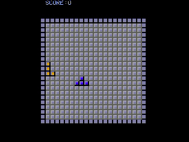

# Tetris 4D (DTEK-V Edition) 🎮

A unique implementation of Tetris featuring 4-directional gravity and movement, designed specifically for the DE10-Lite FPGA board using RISC-V architecture.

## Overview 🌟

Unlike traditional Tetris where pieces only fall downward, this version introduces a revolutionary 4-directional gameplay mechanic. Pieces spawn in the center of the board and can move in any cardinal direction, creating an entirely new strategic experience.

## Demo 📺

## Features 🚀

- **4-Directional Movement**: Pieces can move up, down, left, or right
- **Center Spawning**: All pieces emerge from the board's center
- **Multi-Directional Line Clearing**: Both horizontal and vertical lines can be cleared
- **Dynamic Difficulty**: Speed increases as your score grows
- **3D Visual Effects**: Classic Tetris-like design with L-shaped coloring for 3D appearance
- **Smooth Animations**: Including game over fade effects
- **VGA Display Output**: Clean 320x240 pixel display with 8x8 block size
- **Hardware-Optimized**: Specifically designed for DE10-Lite FPGA

## Technical Specifications 🔧

- **Display**: VGA 320x240 pixels
- **Game Board**: 20x20 grid
- **Block Size**: 8x8 pixels
- **Controls**: Hardware switches and buttons
- **Architecture**: RISC-V
- **Memory**: Memory-mapped I/O for hardware interface

## Controls 🎯

- **Switches 1-4**: Control piece direction (Left, Right, Up, Down)
- **Button**: Rotate piece
- After game over, press button to restart

## Scoring System 🏆

- Single Line: 100 points
- Double Line: 300 points
- Triple Line: 500 points
- Tetris (4 lines): 800 points

## Game Over Conditions ⚠️

The game ends when blocks reach the center of the screen, adding a unique strategic element to the traditional Tetris formula.

## Unique Features 💫

1. **Quad-Directional Gravity**
   - Gravity effects relative to board center
   - Different physics for each quadrant

2. **Enhanced Visuals**
   - 3D block effects using light/dark shading
   - Smooth animations for line clearing
   - Fade effects for game over screen

3. **Performance Optimizations**
   - Hardware-specific optimizations for DE10-Lite
   - Efficient memory usage through careful buffer management
   - Optimized rendering algorithms

## Technical Implementation 🛠️

- Written in C with hardware-specific optimizations
- Uses structured programming methods for game state management
- Implements efficient collision detection and piece movement
- Custom VGA display handling for smooth graphics
- Timer-based game loop with interrupt handling

## Requirements 📋

- DE10-Lite FPGA Board
- VGA Display
- RISC-V toolchain for compilation